# Praktikum 5: JavaScript

<hr>

## Langkah-langkah Paktukum

<br>

### 1. Membuat dokumen HTML dengan nama file <b>lab5_javascript</b> seperti berikut

```html
<!DOCTYPE html>
<html lang="en">
  <head>
    <meta charset="UTF-8" />
    <meta http-equiv="X-UA-Compatible" content="IE=edge" />
    <meta name="viewport" content="width=device-width, initial-scale=1.0" />
    <title>Menegenal JavaScript</title>
  </head>
  <body>
    <h1>Pengenalan JavaScript</h1>
    <h3>Contoh document.write dan console.log</h3>
    <script>
      document.write("hello world");
      console.log("hello world");
    </script>
  </body>
</html>
```

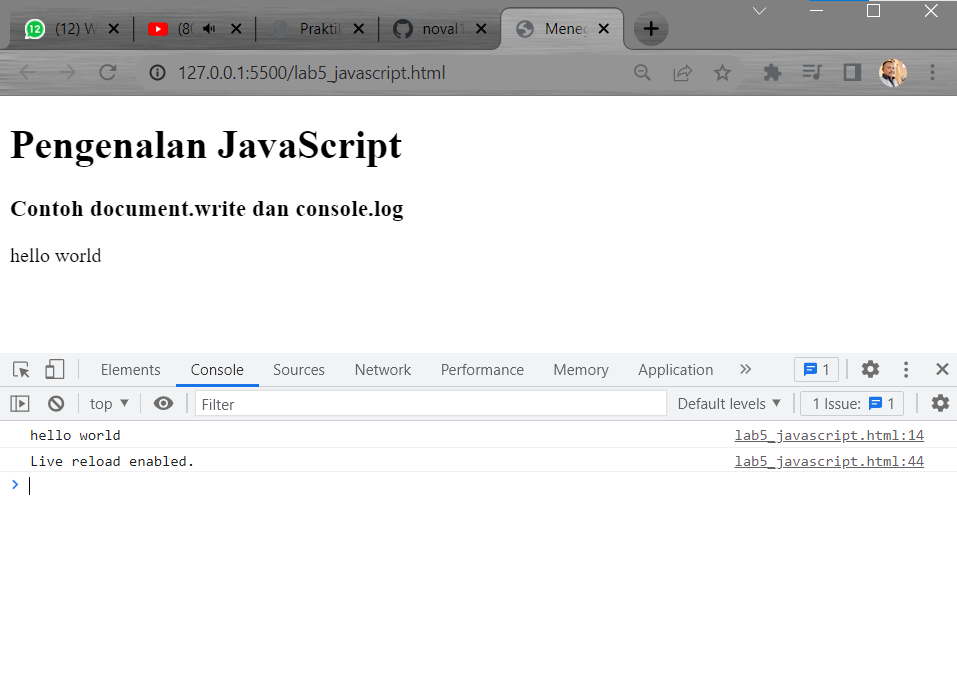
<br>

### Javascript Dasar

- Pemakaian Alert sebagai property window

```html
<html>
  <head>
    <title>alert box</title>
  </head>
  <body>
    <script lang="javascript">
      <!--
          window.alert("ini merupakan pesan untuk anda");
      //-->
    </script>
  </body>
</html>
```

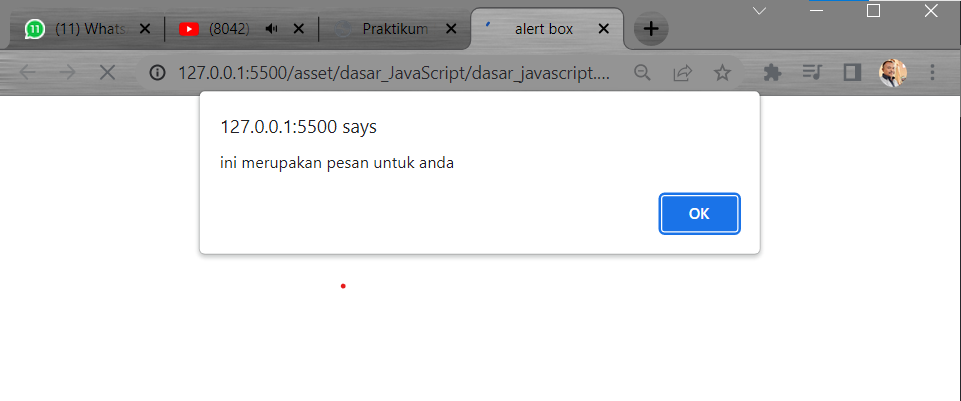
<br>

- Pemakaian method dalam objek

```html
<html>
  <head>
    <title>krip javascript</title>
  </head>
  <body>
    percobaan memakai javascript:<br />
    <script lang="javascript">
      <!--
          document.write("selamat mencoba javascript<br>");
          document.write("semoga sukses!");
      //-->
    </script>
  </body>
</html>
```

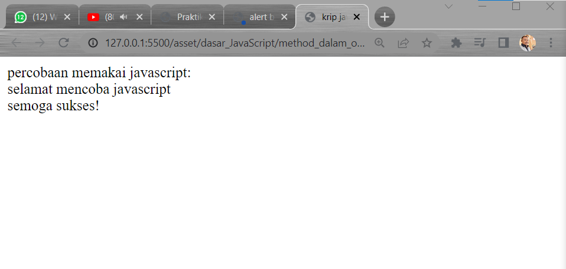
<br>

- Pemakaian Prompt

```html
<html>
  <head>
    <title>Pemasukan data</title>
  </head>
  <body>
    <script lang="javascript">
      <!--
          var nama = prompt ("siapa nama anda?","masukan nama anda");
          document.write("hai," + nama);
      //-->
    </script>
  </body>
</html>
```

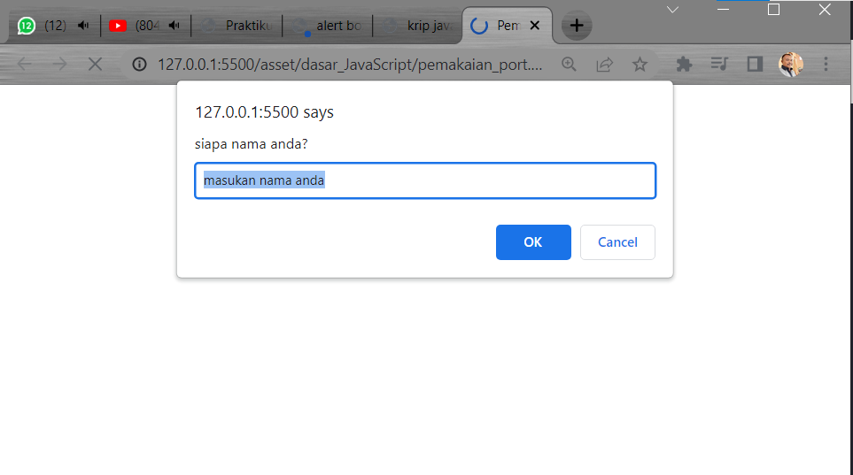
<br>

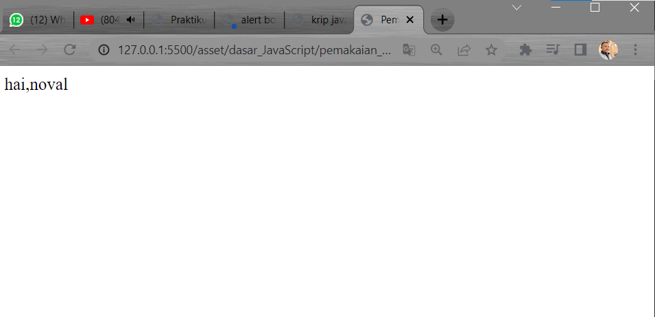
<br>

- Pembuatan fungsi dan cara pemanggilannya

```html
<html>
  <head>
    <title>Contoh program javascript</title>
    <script lang="javascript">
      function pesan (){
          alert ("memanggil javascript lewat body onload")
      }
    </script>
  </head>
  <body onload="pesan()"></body>
</html>
```

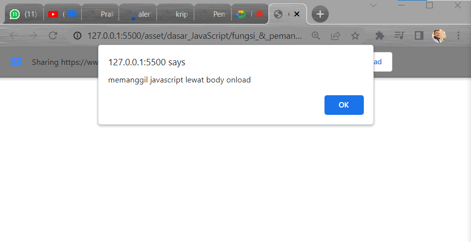
<br>

### Dasar Pemograman Di Javascript

- Oprasi dasar aritmatika

```html
<html>
  <head>
    <title>Contoh program javascript</title>
    <script lang="javascript">
      function test() {
          val1 = window.prompt("input nilai (1-5):")
          switch (val1) {
              case "1":
                  document.write("bilangan satu")
                  break
              case "2":
                  document.write("bilangan dua")
                  break
              case "3":
                  document.write("bilangan tiga")
                  break
              case "4":
                  document.write("bilangan empat")
                  break
              case "5":
                  document.write("bilangan lima")
                  break
                  default :
                  Document.write("bilangan lainnya")
          }
      }
    </script>
  </head>

  <body>
    <input type="button" name="button1" value="switch" onclick="test()" />
  </body>
</html>
```

- Penggunaan oprator switch untuk seleksi kondisi

```html
<html>
  <head>
    <title>Contoh program javascript</title>
    <script lang="javascript">
      function test() {
          val1 = window.prompt("input nilai (1-5):")
          switch (val1) {
              case "1":
                  document.write("bilangan satu")
                  break
              case "2":
                  document.write("bilangan dua")
                  break
              case "3":
                  document.write("bilangan tiga")
                  break
              case "4":
                  document.write("bilangan empat")
                  break
              case "5":
                  document.write("bilangan lima")
                  break
                  default :
                  Document.write("bilangan lainnya")
          }
      }
    </script>
  </head>

  <body>
    <input type="button" name="button1" value="switch" onclick="test()" />
  </body>
</html>
```

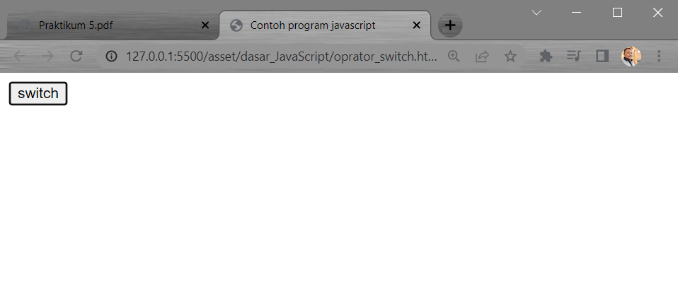
<br>


<br>


<br>

- Form Input

```html
<html>
  <head>
    <title>Form input</title>
    <script lang="javascript">
      function test () {
          var val1=document.kirm.T1.value
          if (val1%2==0)
          document.kirm.T1.value="bilangan genap"
          else
          document.kirm.T2.value="bilangan ganjil"
      }
    </script>
  </head>
  <body>
    <form method="post" name="kirim">
      <p>
        BIL <input type="text" name="T1" size="20" />MERUPAKAN BIL
        <input type="text" name="T2" size="20" />
      </p>
      <p><input type="button" value="TEBAK" name="B1" onclick="test()" /></p>
    </form>
  </body>
</html>
```

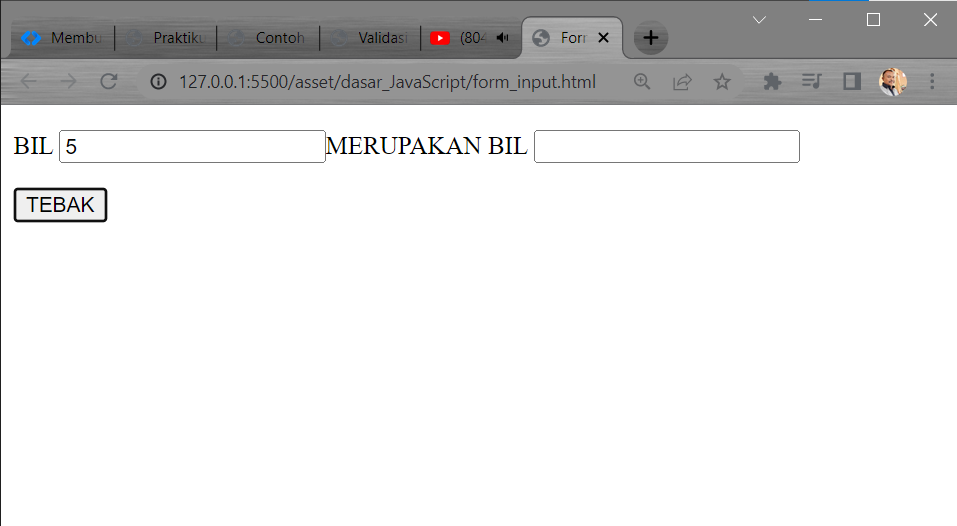
<br>

- Form Button

```html
<html>
  <head>
    <title>Objek Dokumen</title>
  </head>
  <body>
    <script lang="javascript">
      <!--
          function ubahWarnaLB(warna) {
              document.bgColor = warna;
          }
      function ubahWarnaLD(warna) {
          document.fgColor = warna;
      }
      //-->
    </script>
    <h1>test</h1>
    <form>
      <input
        type="button"
        value="Latar Belakang Hijau"
        onclick="ubahWarnaLB('green')"
      />
      <input
        type="button"
        value="Latar Belakang Putih"
        onclick="ubahWarnaLB('white')"
      />
    </form>
    <script lang="javascript">
      <!--
          document.write("Dimodifikasi terakhir pada" + document.lastModified);
      //-->
    </script>
  </body>
</html>
```

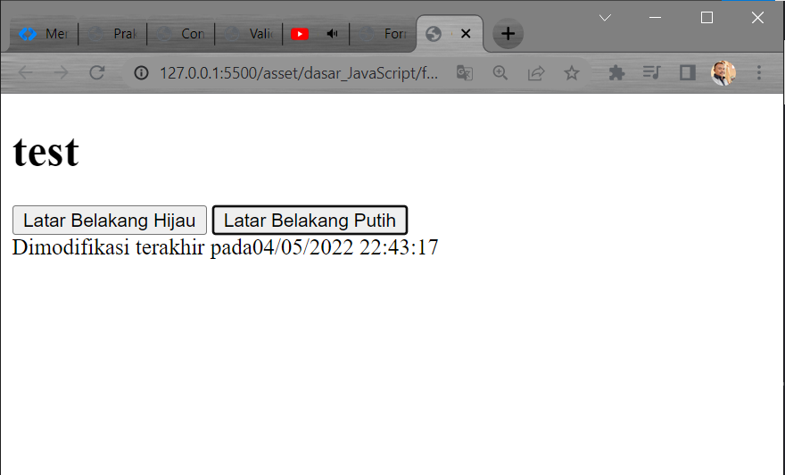
<br>

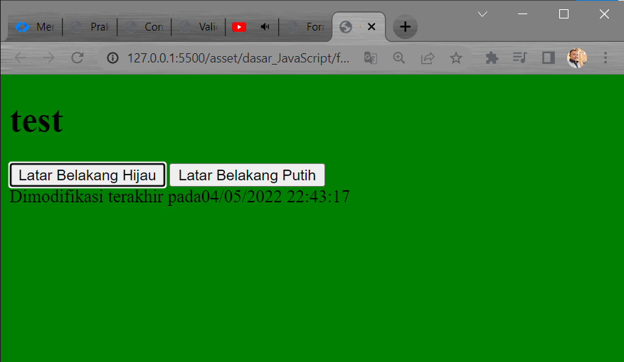
<br>

### HTML DOM

- Pilihan menggunakan <b>_checkbox_</b>

```html
<html>
  <head>
    <title>Daftar Menu</title>
    <script lang="javascript">
      function hitung(ele) {
          var total = document.getElementById('total').value;
          total = (total ? parseInt(total) : 0);
          var harga = 0;

          if (ele.checked) {
              harga = ele.value;
              total += parseInt(harga);
          } else {
              harga = ele.value;
              if (total > 0)
                  total -= parseInt(harga);
          }
          document.getElementById('total').value = total;
      }
    </script>
  </head>

  <body>
    <h1>Daftar Menu Makanan</h1>
    <label
      ><input
        type="checkbox"
        value="5000"
        id="menu1"
        onclick="hitung(this);"
      />Ayam Goreng Rp. 5.000</label
    ><br />
    <label
      ><input
        type="checkbox"
        value="1500"
        id="menu2"
        onclick="hitung(this);"
      />Tempe Goreng Rp. 1.500</label
    ><br />
    <label
      ><input
        type="checkbox"
        value="2000"
        id="menu3"
        onclick="hitung(this);"
      />Telur Rebus Rp. 2.000</label
    >
    <hr />
    <strong>Total Bayar: Rp. <input id="total" type="text" /></strong>
  </body>
</html>
```

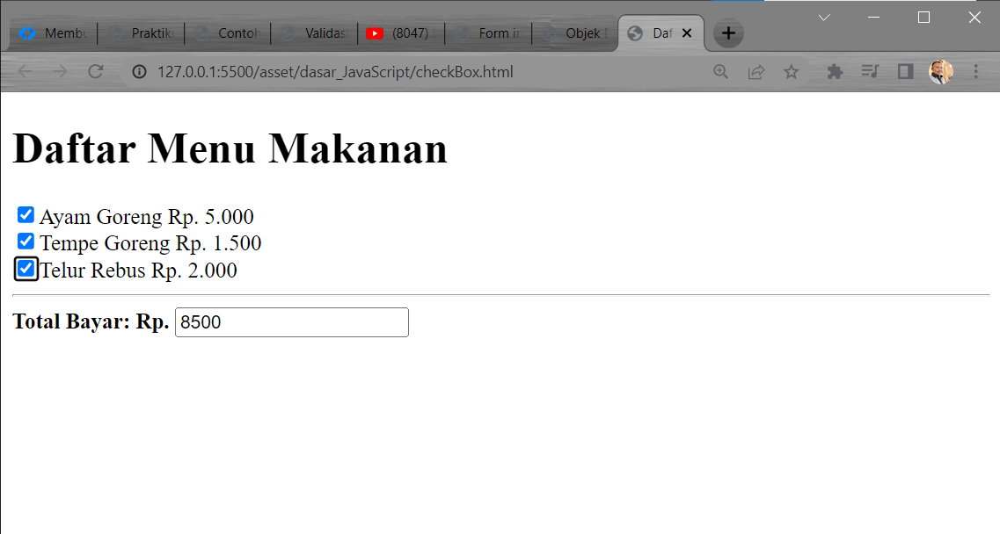

<hr/>

# Pertanyaan dan Tugas

<h/>

## 1. Buat script untuk melakukan validasi pada isian form.

- Membuat Document HTML sebagai berikut

<b>_HTML_</b>

```html
<html>
  <head>
    <link href="asset/img/LOGO UPB.png" rel="icon" />
    <title>validasi mahasiswa</title>
    <link rel="stylesheet" href="style.css" />
  </head>
  <body>
    <center>
      <h2>Login mahasiswa javascript</h2>
    </center>
    <div class="login">
      <form action="#" method="POST" onSubmit="validasi()">
        <div>
          <label>Nama Lengkap:</label>
          <input type="text" name="nama" id="nama" />
        </div>
        <div>
          <label>Email:</label>
          <input type="email" name="email" id="email" />
        </div>
        <div>
          <label>Password:</label>
          <input type="password" name="password" id="password" />
        </div>
        <div>
          <label>Alamat:</label>
          <textarea cols="40" rows="5" name="alamat" id="alamat"></textarea>
        </div>
        <div>
          <input type="submit" value="Daftar" class="tombol" />
        </div>
      </form>
    </div>
  </body>
  <script type="text/javascript">
    function validasi() {
      var nama = document.getElementById("nama").value;
      var email = document.getElementById("email").value;
      var password = document.getElementById("password").value;
      var alamat = document.getElementById("alamat").value;
      if (nama != "" && email != "" && alamat != "") {
        return true;
      } else {
        alert("Anda harus mengisi data dengan lengkap !");
      }
    }
  </script>
</html>
```

<b>_style.css_</b>

```css
body {
  background: #3498db;
  font-family: sans-serif;
}
h2 {
  color: #fff;
}
.login {
  padding: 1em;
  margin: 2em auto;
  width: 17em;
  background: #fff;
  border-radius: 3px;
}
label {
  font-size: 10pt;
  color: #555;
}
input[type="text"],
input[type="email"],
input[type="password"],
textarea {
  padding: 8px;
  width: 95%;
  background: #efefef;
  border: 0;
  font-size: 10pt;
  margin: 6px 0px;
}
.tombol {
  background: #3498db;
  color: #fff;
  border: 0;
  padding: 5px 8px;
}
```

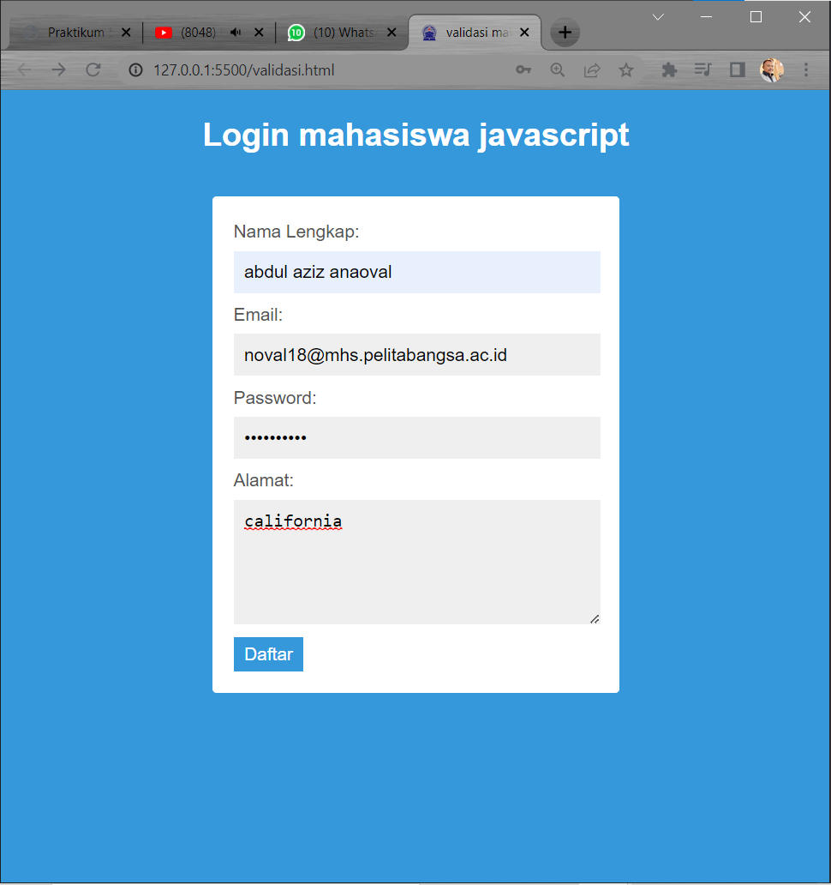
<br>

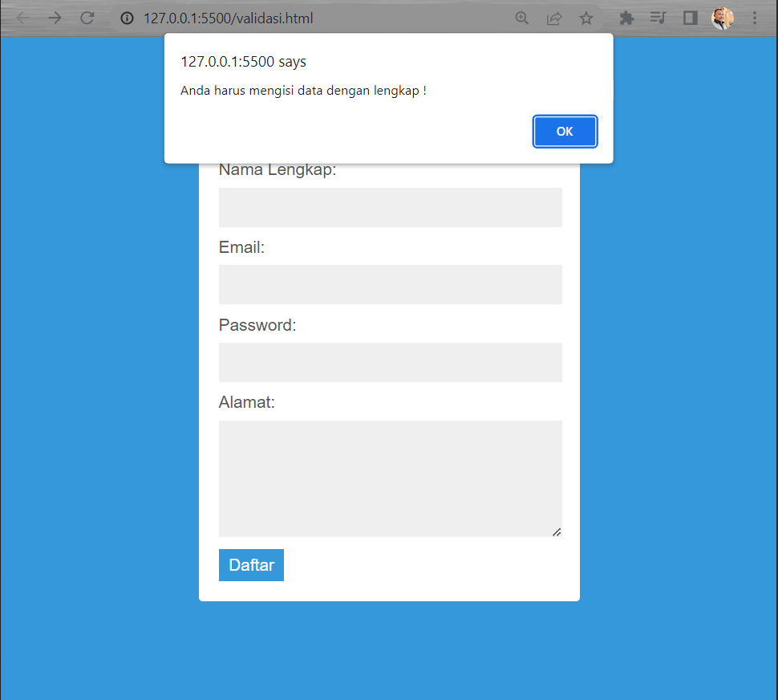
<br>